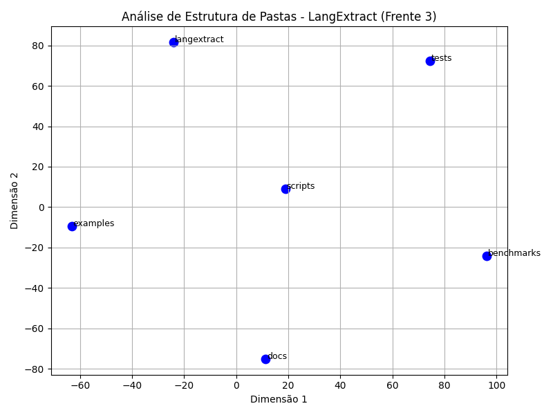

# 🧠 Engenharia de Software II – 2025.2 – T04  
### Projeto: **LangExtract – Análise de Padrões de Arquitetura**

Este é o repositório oficial da **Atividade 1** da disciplina **Engenharia de Software II (Turma T04)**.  
O objetivo é aplicar técnicas de **Processamento de Linguagem Natural (PLN)** para identificar **Padrões de Arquitetura de Software** em um projeto de código aberto.

O trabalho é dividido em três **frentes de análise**, baseadas no material da disciplina (conforme o [PDF de sugestão](https://www.google.com/search?q=Sugest%25C3%25A3o_Atividade1.pdf)):

1. 🗒️ **Frente 1 – Documentação (READMEs)**  
2. 🧩 **Frente 2 – Código-Fonte (scripts `.py`)**  
3. 🗂️ **Frente 3 – Estrutura do Projeto (pastas, dependências)**  

---

## 🎯 Projeto Alvo da Análise

- **Repositório:** [`google/langextract`](https://github.com/google/langextract)  
- **Descrição:** Biblioteca Python desenvolvida pelo Google que utiliza **Modelos de Linguagem (LLMs)** para extrair informações estruturadas (como dados médicos) a partir de textos não estruturados.  
- **Hipótese Inicial:**  
  A leitura do `README.md` sugere o uso de uma **Arquitetura em Camadas** (separando extração, I/O e visualização) e uma **Arquitetura de Plugins** (para permitir múltiplos provedores de LLMs, como Gemini, OpenAI e Ollama).

---

## ⚙️ Como Reproduzir a Análise

Este repositório contém todo o código necessário para replicar as análises realizadas nas três frentes.

### 1. Configuração do Ambiente

> Recomendamos o uso de um ambiente virtual (`venv`) para isolar as dependências.

```bash
# 1. Clone o repositório
git clone https://github.com/[SEU_USUARIO]/Engenharia_SoftwareII_2025-2_T04_langextract.git
cd Engenharia_SoftwareII_2025-2_T04_langextract

# 2. Crie e ative o ambiente virtual (opcional, mas recomendado)
python -m venv venv
source venv/bin/activate  # No Windows: .\venv\Scripts\activate

# 3. Instale as dependências
pip install -r requirements.txt
```

### 2. Executando as Análises

Os scripts de cada frente estão localizados na pasta `/scripts`.

```bash
# Frente 1 – Documentação
python scripts/analise_frente_documentacao.py

# Frente 2 – Código-Fonte (a ser implementado)
python scripts/analise_frente_sourcecode.py

# Frente 3 – Estrutura do Projeto (a ser implementado)
# python scripts/analise_frente_estruturadoprojeto.py

```

## 🌿 Fluxo de Trabalho (Git Branches)

| Branch | Função |
|--------|--------|
| **main** | Branch principal, representa a versão final e estável. Nenhum commit direto é feito nela. |
| **frente-x-nome** | Branches individuais para cada frente ou tarefa (ex: `frente-1-documentacao`). |

---

## ⚙️ Padrão de Commits

Os commits devem seguir o formato:

```bash
tipo: descrição breve
```
Exemplo:
```bash
feat: adiciona análise da frente 1 de documentação
fix: corrige erro de importação no script de análise
docs: atualiza instruções de execução no README
```


---

## 🧩 Estrutura de Pastas

```bash
.
├── data/                 # Dados brutos e processados
├── outputs/              # Resultados gerados pelas análises
├── scripts/              # Scripts de execução de cada frente
│   ├── analise_frente_documentacao.py
│   ├── analise_frente_sourcecode.py
│   └── analise_frente_estruturadoprojeto.py
├── reports/              # Relatórios finais em formato .md e .pdf
└── README.md             # Documento principal com instruções do projeto
```
## 🗒️ Análise da Frente 1: Documentação (README.md)

**Responsável:** Miguel Lucas Santana Freire

### 🎯 Objetivo
Analisar a documentação textual do projeto (`README.md`) para identificar padrões de arquitetura.

---

### 🧠 Modelo Utilizado
**Modelo:** `zero-shot-classification`  
**Base:** `facebook/bart-large-mnli`


### 💡 Por que este modelo?
Dentre os testados, escolhemos o *Zero-Shot Classification* porque ele nos permite classificar um texto usando **rótulos definidos manualmente**, sem a necessidade de treinar um modelo do zero.  
Isso é ideal para projetos de análise arquitetural com poucos exemplos anotados.

### ⚙️ Metodologia
Devido à limitação da *janela de contexto* dos modelos (que não conseguem ler documentos muito longos, cerca de **1024 tokens**), **não analisamos o `README.md` inteiro**.  
Em vez disso, foram selecionadas manualmente as seções com **maior densidade de informação arquitetural**:

- **“Why LangExtract?”** – descreve o pipeline do sistema.  
- **“Adding Custom Model Providers”** – explica o mecanismo de plugins.

O script executado foi:

```bash
python scripts/analise_frente_1.py
```

Foram definidos 5 rótulos candidatos para classificação.

### 📊 Resultado da Análise (Frente 1)

O modelo retornou as seguintes pontuações de confiança:

### 📊 Resultado da Análise

O modelo retornou as seguintes pontuações de confiança:

```plaintext
Texto Analisado: '
Why LangExtract?
1.  Precise Source Grounding: Ma...
----------------------------------------
  plugin architecture              | 60.83%
  layered architecture             | 19.85%
  component-based system           | 11.56%
  pipe-and-filter architecture     | 04.23%
  MVC architecture                 | 03.53%
----------------------------------------

```
## 🗂️ Análise da Frente 3: Estrutura do Projeto

**Responsável:** João Antônio Sousa da Silva

### 🎯 Objetivo

Analisar a organização estrutural do projeto (LangExtract), identificando possíveis padrões arquiteturais com base na disposição dos diretórios principais e sua relação semântica.

### 🧠 Modelo Utilizado

Modelo: feature-extraction
Base: bert-base-uncased

### 💡 Por que este modelo?

Escolhemos o modelo BERT-base (feature-extraction) por ser amplamente utilizado para representar textos curtos, como nomes de diretórios e módulos, em vetores semânticos de alta dimensionalidade.
Esses vetores permitem visualizar relações de similaridade e agrupamentos lógicos, úteis para inferir padrões estruturais e estilos arquiteturais como camadas ou módulos funcionais.

### ⚙️ Metodologia

A análise foi conduzida em etapas:

- **Clonagem do repositório original do LangExtract.**

- **Listagem das pastas principais:**
  
```bash
benchmarks, docs, examples, langextract, scripts, tests
```

- **Extração de embeddings dos nomes de cada pasta usando o modelo bert-base-uncased (modo feature-extraction).**

- **Redução de dimensionalidade com o algoritmo t-SNE para projetar as representações em duas dimensões.**

- **Geração de visualização gráfica dos agrupamentos.**

- **Armazenamento dos resultados em resultados_frente3.txt e estrutura_projeto_frente3.png.**

O script executado foi:

```bash
python scripts/analise_frente_estruturadoprojeto.py
```

### 📊 Resultado da Análise (Frente 3)

A análise produziu as seguintes coordenadas 2D (t-SNE) para os módulos principais:

```bash
=== RELATÓRIO - FRENTE 3: Estrutura de Projeto ===

Repositório: https://github.com/google/langextract
Modelo: bert-base-uncased

Pastas analisadas:
 - benchmarks
 - docs
 - examples
 - langextract
 - scripts
 - tests

Coordenadas 2D geradas (t-SNE):

benchmarks: (96.28, -24.08)
docs: (11.33, -75.00)
examples: (-63.22, -9.55)
langextract: (-24.19, 81.64)
scripts: (18.82, 9.05)
tests: (74.39, 72.31)
```

### 📈 Visualização Gráfica

A projeção t-SNE foi representada no gráfico abaixo, gerando o arquivo:



### 🧩 Interpretação

A projeção indica agrupamentos coerentes entre módulos do projeto:

- langextract e tests aparecem próximos, sugerindo uma forte relação entre a implementação principal e a validação.

- scripts e benchmarks se situam em uma camada de suporte, relacionados à execução e análise de desempenho.

- examples e docs formam uma camada externa, mais voltada à documentação e exemplos de uso.

Esses agrupamentos sugerem que o projeto segue uma arquitetura em camadas, com separação clara entre núcleo funcional, suporte e documentação — um indício de boa modularização e organização arquitetural.

### ✅ Conclusão

A análise estrutural do projeto LangExtract evidencia uma organização bem definida, na qual cada diretório cumpre uma função distinta dentro de um arranjo em camadas.
Essa estrutura reforça a presença de boas práticas de engenharia de software e baixo acoplamento entre módulos, características de sistemas escaláveis e manuteníveis.

## 🧠 Observações Finais

- Sempre execute os scripts a partir da raiz do projeto.
- Use **ambiente virtual** para manter as dependências isoladas.
- Mantenha o padrão de branch e commit para facilitar o versionamento.
- Antes de abrir um **pull request**, execute os scripts e valide os resultados localmente.

---

